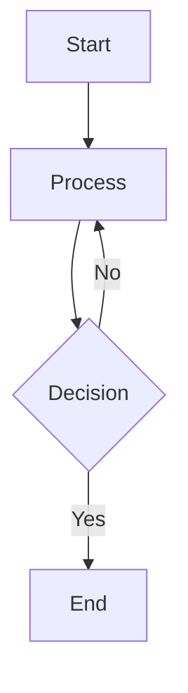

# 마크다운 스타일 가이드

이 포스트는 블로그에서 사용 가능한 모든 마크다운 스타일을 보여줍니다.

## 텍스트 스타일

일반 텍스트입니다. **굵은 텍스트**와 _기울임 텍스트_, 그리고 ***굵은 기울임***을 사용할 수 있습니다.

~~취소선~~도 사용 가능합니다.

## 링크와 이미지

[Next.js 공식 사이트](https://nextjs.org)를 방문해보세요.

자동 링크: https://github.com

## 코드

인라인 코드는 `const greeting = "Hello World";` 이렇게 사용합니다.

코드 블록:

```javascript title="example.js"
function fibonacci(n) {
    if (n <= 1) return n;
    return fibonacci(n - 1) + fibonacci(n - 2);
}

console.log(fibonacci(10)); // 55
```

```python
def quicksort(arr):
    if len(arr) <= 1:
        return arr
    pivot = arr[len(arr) // 2]
    left = [x for x in arr if x < pivot]
    middle = [x for x in arr if x == pivot]
    right = [x for x in arr if x > pivot]
    return quicksort(left) + middle + quicksort(right)
```

```swift
let a = 3
```

### Diff 예제

```javascript
function calculate(a, b) {
- return a + b;
+ return a * b;
}

- const result = calculate(5, 3); // 8
+ const result = calculate(5, 3); // 15
```

### 코드 하이라이팅

```swift {6}
var a = 3
var b = 2
print(add(a, b))

func add(_ a: Int, _ b: Int) -> `Int` {
    return a + b
}
```

### 줄 하이라이트 테스트

```javascript {1, 3, 4, 6-7}
const a = 1;
const b = 2;
const c = 3;
const d = 4;
const e = 5;
const f = 6;
const g = 7;
```

### 단어 하이라이트 테스트

```javascript
function add(a, b) {
    return `a` + `b`;
}
```

## Mermaid 다이어그램



```mermaidc
graph TD
    A[Start] --> B[Process]
    B --> C{Decision}
    C -->|Yes| D[End]
    C -->|No| B
```

## 리스트

### 순서 없는 리스트

- 첫 번째 항목
- 두 번째 항목
    - 중첩된 항목 1
    - 중첩된 항목 2
- 세 번째 항목

### 순서 있는 리스트

1. 첫 번째 단계
2. 두 번째 단계
3. 세 번째 단계
    1. 세부 단계 A
    2. 세부 단계 B

### 체크리스트

- [x] 완료된 작업
- [x] 또 다른 완료 작업
- [ ] 진행 중인 작업
- [ ] 예정된 작업

## 인용문

> 훌륭한 개발자는 좋은 코드를 작성하지만,
> 최고의 개발자는 좋은 문서를 작성합니다.

> 단일 라인 인용문입니다.

## 표

| 기능        | JavaScript | TypeScript | Python     |
| ----------- | ---------- | ---------- | ---------- |
| 정적 타이핑 | ❌         | ✅         | 선택적     |
| 컴파일      | ❌         | ✅         | ❌         |
| 인기도      | ⭐⭐⭐⭐⭐ | ⭐⭐⭐⭐   | ⭐⭐⭐⭐⭐ |

성능 비교:

| 라이브러리 | 번들 크기 | 속도 | 사용성 |
| :--------- | --------: | :--: | :----- |
| React      |      44KB | 빠름 | 쉬움   |
| Vue        |      34KB | 빠름 | 쉬움   |
| Angular    |     143KB | 보통 | 보통   |

## 구분선

첫 번째 섹션

---

두 번째 섹션

---

세 번째 섹션

## 중첩된 요소

1. **프론트엔드 개발**
    - HTML/CSS 기초
    - JavaScript 심화
        ```javascript
        const skills = ["React", "Vue", "Angular"];
        ```
    - 프레임워크 선택

2. **백엔드 개발**

    > API 설계가 가장 중요합니다.
    - RESTful API
    - GraphQL

3. **데브옵스**
    - CI/CD 파이프라인
    - 클라우드 서비스

## 이모지

텍스트에 이모지도 사용할 수 있습니다! 🎉 🚀 💻 🎨 ✨

## 특수 문자

HTML 엔티티: &copy; &trade; &reg;

특수 기호: © ® ™ € £ ¥

## 첨자

^^난 윗 첨자^^
,,난 아랫 첨자,,

## 토글

:::toggle 토글 연습
이건 토글 안 내용이지용
:::

## 인용

> 이건 일반 인용

:::quote
이건 문구 인용
:::

:::warning 주의사항
이건 주의사항 내용
:::

:::error 오류 발생
이런 오류 발생 내용
:::

:::info 참고사항
이건 참고사항 내용
:::

:::success 완료!
이건 완료 내용
:::

## 테이블 셀 병합

**일반 테이블**

<!-- prettier-ignore -->
|00|01|02|03|04|
|:-:|:-:|:-:|:-:|:-:|
|10|11|12|13|14|
|20|21|22|23|24|
|30|31|32|33|34|
|40|41|42|43|44|

**가로 셀 병합**

<!-- prettier-ignore -->
|00|01|02|03|04|
|:-:|:-:|:-:|:-:|:-:|
|10|<-2>11|12|13|
|20|21|<-3>22|
|30|<-4>31|
|<-5>40|

**세로 셀 병합**

<!-- prettier-ignore -->
|00|01|02|03|04|
|:-:|:-:|:-:|:-:|:-:|
|10|<!2>11|12|13|<!4>14|
|20|22|<!3>23|
|30|31|32|
|40|41|42|

**가로 세로 셀 병합**

<!-- prettier-ignore -->
|00|01|02|03|04|
|:-:|:-:|:-:|:-:|:-:|
|10|<-2><!2>11|13|14|
|20|23|24|
|30|31|32|33|34|
|40|41|42|43|44|

## 마무리

이것으로 **마크다운 스타일 테스트**를 마칩니다.

모든 스타일이 제대로 렌더링되는지 확인해보세요! ✅
